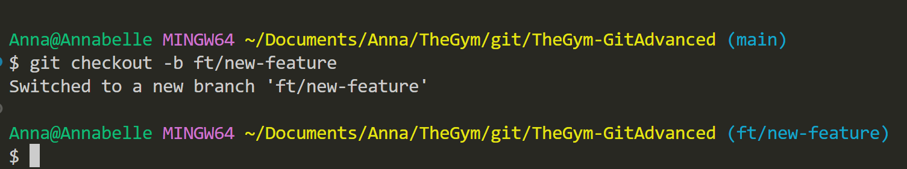
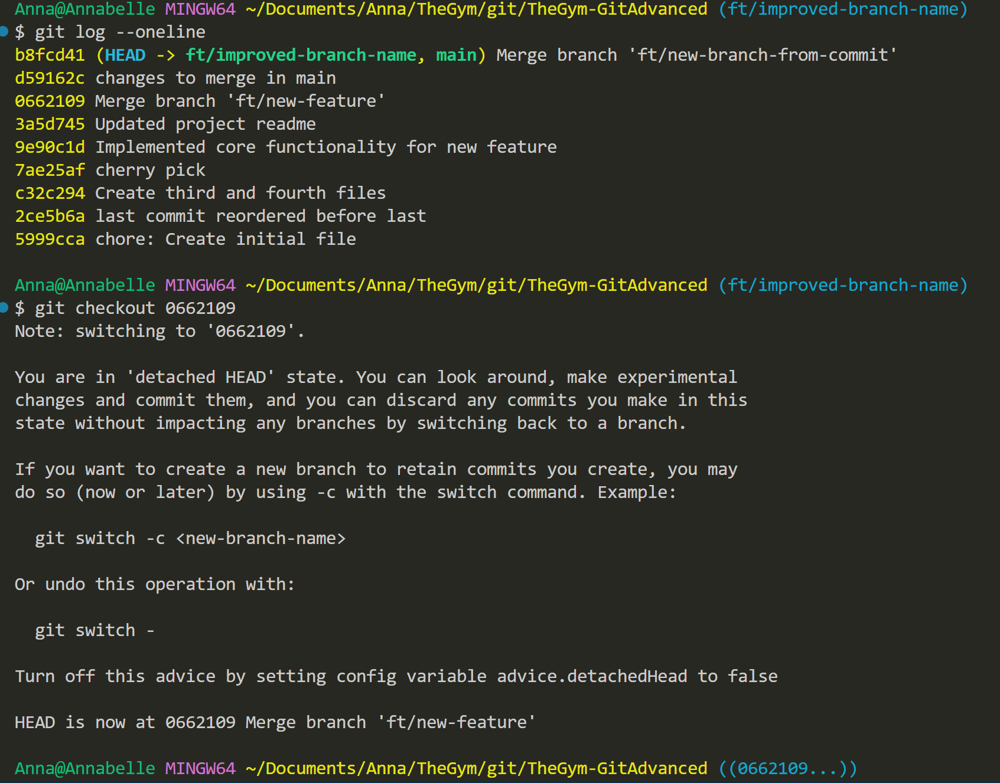

# Git Advanced Practice

## Part 1: Refining Git History

### 1. Missing File Fix

```bash
git status and git log
```


#### Solution


### 2. Editing commit History


### 3. Keeping History Tidy - Squashing Commits


### 4. Splitting Commit


### 5. Advanced git squashing

### 6. Dropping a commit


### 7. Reordering Commits


### 8. Cherry-picking commits


## Part 2: Branching Basics

### 1. Feature Branch Creation:



### 2. Working on the feature branch


### 3. Switching Back and Making More Changes


### 5. Branch Deletion:


### 6. Creating a Branch from a Commit


### 7.Branch merging


### 8. Branch Rebasing


### 9. Renaming branches


### 10. checkout Head detached



## Part 3: Advanced Workflows

### 1. Stashing Changes:


### 2. Retrieving Stashed Changes


### 3. Branch Merging Conflicts


#### Resolved


### 6. Ignoring files

Created gitignore file with /tmp folder in it

### 7. Working with tags


### 8. Listing and Deleting Tags


